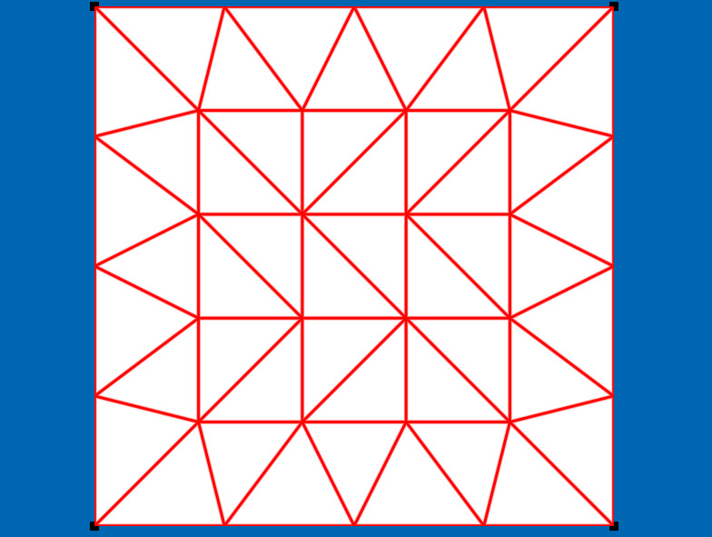
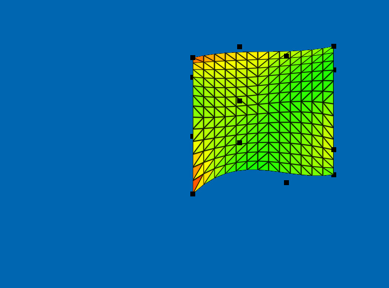

# TesselationShaderExample 





Example code for three applications of tesselation shaders using Magnum Engine.
- Line tesselation
- Quad tesselation
- Surface tesselation


# Prerequisites

- GLFW
- [Magnum Engine](https://github.com/mosra/magnum) 

# Build

```
mkdir build
cmake ..
```

# Key Usage

Switching between schemas :
- Line : `1`
- Quad : `2`
- Surface : `3`

Increasing-Decreasing tesselation :
- Line : `Up` , `Down`
- Quad : 
    - Outer tesselation :  `Up` , `Down`
    - Inner tesselation :  `Right` , `Left`
- Surface :  `Up` , `Down`

Exit :  `ESC`


# Reference

[Shader's mainly are taken here and some parts are changed](https://www.packtpub.com/eu/game-development/opengl-4-shading-language-cookbook-second-edition)
